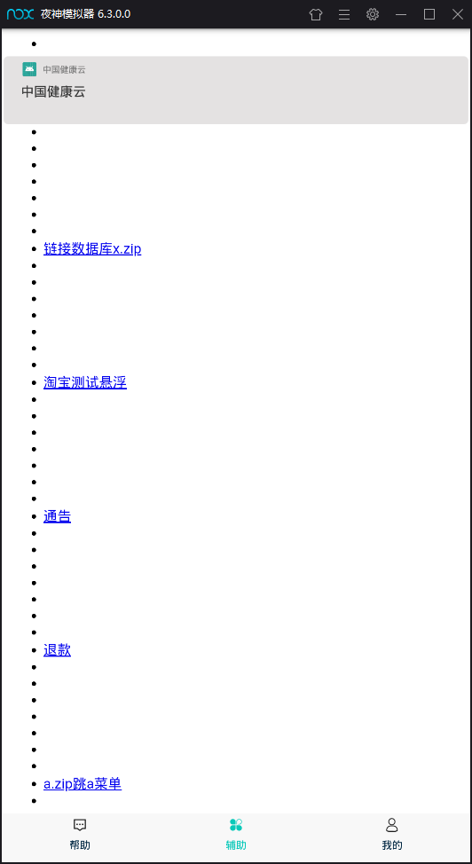

### 一些练习

##### 2019年07月11日 10时32分42秒
增加了android直连mysql 

#### 2019年8月15日 17:53:23
增加了仿qqToast

##### 2019年11月21日 00:39:47
学习google jetPack的 viewmmodel (关联生命周期的方式来管理ui的数据，旋转屏幕数据依然不会被销毁)

##### 2019年11月21日 22:59:29
学习google JetPack 的 LiveData  感知用户数据发生变化从而更新Ui

##### 2019年11月22日 00:25:39
进行综合练习  ViewModel LiveData  DataBinding  篮球积分器
  用ViewModel 管理数据 使逻辑更加合理，代码更加清晰 
